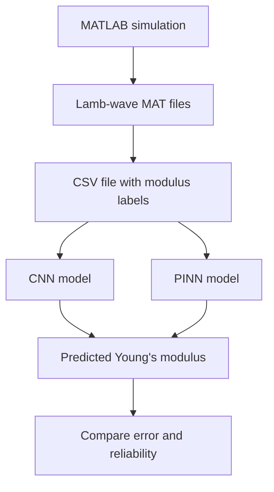

# Machine Learning for Young Modulus Indentification #

## **Simulated Lamb-Wave and Using CNN & PINN for Predicting Modulus**

## **Team and Responsibilities**

Our team members are Mashal Shami and Jannatul Ferdausi.

- **Mashal:** MATLAB simulations, comparing the PINN and CNN, graphs, slides, and documenting results.
- **Jannatul:** MATLAB simulations, PINN model, physics-loss setup, inverse-prediction experiments, and checking whether the PINN is converging correctly.
- **Both team members:** Choosing experiment settings, reading papers, comparing results, writing the report, and preparing the presentation.

We plan to meet at least once a week to check progress and decide what to do next. We will use GitHub and Google Drive to share code, datasets, slides, and notes. We will also use GitHub commits and short notes in the README to show each person’s contributions.

## **Feedback Received and Responses**

Our professor suggested using a Physics-Informed Neural Network (PINN) for our Lamb-wave project. We decided to include a PINN because it uses both machine learning and physics knowledge about wave propagation.

We will compare the PINN with a normal Convolutional Neural Network (CNN). The CNN will learn only from waveform data, while the PINN will learn from waveform data and a physics-based loss.

## **Problem and Motivation**

In many real situations, engineers need to learn about a material without cutting it, breaking it, or damaging it. This matters for airplane parts, bridges, pipelines, and machines.

Lamb waves are vibrations that travel through a thin plate. The waves change depending on the material. One important material property is Young’s modulus, which tells us how stiff a material is. If Young’s modulus changes, the Lamb-wave signal can also change.

Our project uses simulated Lamb-wave signals from a 1 mm plate. The goal is to give a machine-learning model a wave signal and have it predict the Young’s modulus of the material in GPa.

For now, we are focusing on pristine, meaning undamaged, plates. Later, the project could be expanded to include damaged materials and defect detection.

## **Research Questions and Hypotheses**

- **RQ1:** Can a CNN predict Young’s modulus from a simulated Lamb-wave signal?
- **RQ2:** Can a PINN predict Young’s modulus while also following a physics-based wave constraint?
- **RQ3:** Which model gives lower prediction error: the CNN or the PINN?
- **RQ4:** Does using more training data, including repeated signals with different noise, improve the prediction results?

- **H1:** Both models will predict Young’s modulus more accurately for values close to the training-data range.
- **H2:** The PINN will have a small PDE loss after successful training because it includes physics rules in training.
- **H3:** Adding more varied training examples will help the models generalize better to unknown modulus values.

## **Related Work**

Physics-Informed Neural Networks, or PINNs, combine machine learning with physics equations. Instead of only fitting data, the model is also trained to reduce errors in a physical equation. Raissi et al. introduced PINNs for solving forward and inverse physics problems using neural networks [1]. We use this idea because our project is an inverse problem: we want to estimate Young’s modulus from a wave signal.

The paper by Mehtaj and Banerjee is especially related to our project. It reviews scientific machine-learning methods for guided waves and surface acoustic waves, including PINNs, physics-guided neural networks, and neural operators [2]. The paper explains why PINNs can be useful for wave-propagation problems because they combine wave data with governing physics. Our project is smaller and more focused: we will use simulated Lamb-wave data to predict Young’s modulus and compare a PINN with a regular CNN.

Lamb waves are commonly used for non-destructive testing because their behavior depends on material properties and the geometry of a plate [3]. Our project uses this same idea, but focuses on using machine learning to estimate material stiffness.

## **Proposed System or Approach**

We will use the MATLAB Lamb-wave simulation code to create wave data for different Young’s modulus values. Each simulation creates a `.mat` file containing:

- `time`: time values of the wave signal
- `loc`: locations along the plate
- `waveformdata`: simulated wave amplitudes
- Young’s modulus label in GPa

For the first version of the project, we will keep these settings fixed:

- Plate condition: pristine
- Plate thickness: 1 mm
- Frequency: 120 kHz
- Noise level: 15 dB
- Density and Poisson’s ratio: fixed

We will change Young’s modulus across the dataset. Our training values will range from about 1 GPa to 100 GPa.

### **CNN Model**

The CNN will use the waveform from a sensor location near 75 mm. The model will receive a long list of wave-amplitude values over time and predict one number: Young’s modulus in GPa.

The CNN is our baseline model because it learns patterns from the data without using the wave equation.

### **PINN Model**

The PINN will also learn from the Lamb-wave data, but it will include physics-based loss values during training:

- **Data loss:** how different the model prediction is from the simulated data
- **PDE loss:** how much the prediction breaks the physics equation

The PINN will be used for inverse prediction:

> Unknown Lamb-wave signal → predicted Young’s modulus

## **Evaluation Plan**

| Research Question | Experiment | Main Metric |
|---|---|---|
| RQ1 | Train the CNN on known modulus values and test it on unseen values | Error percentage |
| RQ2 | Train the PINN and estimate unseen modulus values | Error percentage and PDE loss |
| RQ3 | Compare CNN and PINN predictions on the same test files | Comparison table |
| RQ4 | Train with different dataset sizes or repeated signals | Change in prediction error |

### **Dataset**

We will create simulated pristine Lamb-wave data in MATLAB.

- Training range: about 1–100 GPa
- Training data: at least 30 known Young’s modulus values
- Repeated data: some modulus values will be simulated more than once with different random noise
- Test data: unknown values such as 43.02 GPa, 50 GPa, and 91 GPa
- Test files will not be included in the training CSV file

### **Controlled Factors**

For the first experiments, we will keep these values the same:

- 1 mm plate thickness
- 120 kHz frequency
- 15 dB noise
- Pristine material condition
- Same sensor location for the single-sensor CNN

### **Metrics**

We will report:

- Actual Young’s modulus in GPa
- Predicted Young’s modulus in GPa
- Absolute error in GPa
- Error percentage
- CNN training RMSE
- PINN data loss
- PINN PDE loss
- Training time

## **Expected Deliverables**

By the end of the project, we expect to have:

- MATLAB Lamb-wave simulation code
- MATLAB code for creating repeated training examples
- Labeled `.mat` waveform files
- CSV files with waveform filenames and modulus labels
- CNN training and prediction scripts
- PINN training and inverse-prediction scripts
- Saved model checkpoints
- Tables of predicted versus actual Young’s modulus
- Graphs of waveform data and prediction errors
- A README with setup and run instructions
- Final slides and final report

## **Timeline and Milestones**

| Period | Milestone | Evidence of Completion | Owner(s) |
|---|---|---|---|
| Week 1 | Finish dataset organization | Training and test files are labeled correctly | Both |
| Week 2 | CNN baseline | CNN trains and predicts an unknown modulus | Mashal |
| Week 3 | PINN baseline | PINN trains and reports data loss and PDE loss | Jannatul |
| Week 4 | Compare models | Results table compares CNN and PINN | Both |
| Week 5 | Improve dataset and experiments | More repeats or more test cases are run | Both |
| Week 6 | Final report and slides | Final figures, README, report, and presentation are complete | Both |

## **Risks and Mitigations**

| Risk | Early Warning Sign | Mitigation | Fallback |
|---|---|---|---|
| Model predicts similar values for every test waveform | Very different test cases have nearly the same prediction | Add more training examples across the full modulus range | Report the model limitation clearly |
| CNN overfits | Training error is much lower than testing error | Use more training examples and separate testing files | Use the original CNN as a baseline only |
| PINN does not converge | PDE loss stays very large | Change training steps, learning rate, normalization, or loss weights | Focus on CNN results and explain the PINN limitation |
| Training is slow on laptops | Training takes too long or overheats the computer | Use smaller runs first and keep laptop plugged in | Reduce number of steps or model size |
| Dataset labels do not match files | Script cannot find a waveform filename | Use scripts to recreate and check the CSV manifest | Regenerate the CSV file automatically |

## **Reproducibility Plan**

We will document the following in our GitHub repository:

- MATLAB version
- Python version
- PyTorch, NumPy, SciPy, and pandas versions
- Computer hardware used
- Random seeds
- Training commands
- Number of CNN epochs and PINN steps
- Dataset CSV files
- Test waveform filenames
- Saved model checkpoints
- Result tables and graphs

The README will include one full example for training a model and one full example for predicting Young’s modulus from an unknown waveform.

We used AI tools to help us understand error messages, explain concepts, and draft initial code ideas. We will check, test, and document the final code that we use for the project.

## **References**

[1] M. Raissi, P. Perdikaris, and G. E. Karniadakis, “Physics-informed neural networks: A deep learning framework for solving forward and inverse problems involving nonlinear partial differential equations,” *Journal of Computational Physics*, vol. 378, pp. 686–707, 2019. https://doi.org/10.1016/j.jcp.2018.10.045

[2] N. Mehtaj and S. Banerjee, “Scientific Machine Learning for Guided Wave and Surface Acoustic Wave (SAW) Propagation: PgNN, PeNN, PINN, and Neural Operator,” *Sensors*, vol. 25, no. 5, article 1401, 2025. https://doi.org/10.3390/s25051401

[3] I. A. Viktorov, *Rayleigh and Lamb Waves: Physical Theory and Applications*. New York: Plenum Press, 1967.
